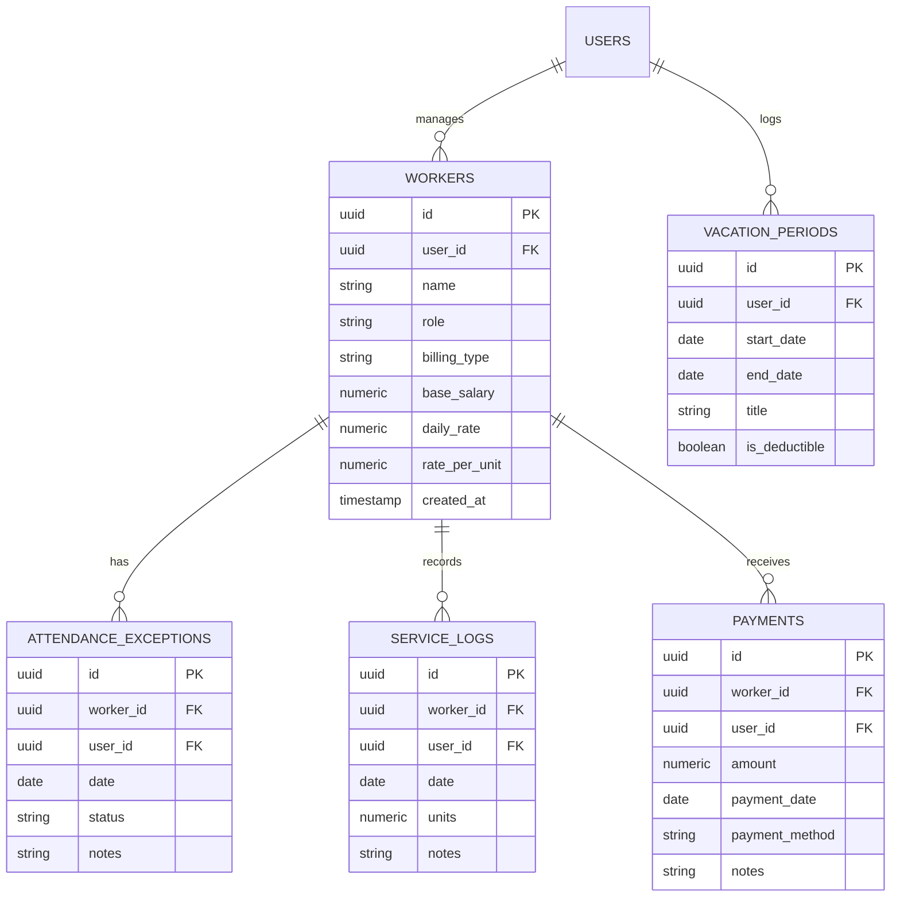

# GharSaathi (GharSaathi Household Management App) — Complete Documentation

> **Project Reference / Design System**: Stitch Project ID `13314428532927951411`  
> **Design Theme**: Premium Household Ledger  
> **Primary Target**: Native-feel Mobile Web Application (Android & iOS)

---

## 1. Project Overview & Objective

**GharSaathi** is a mobile-first household financial ledger and domestic staff management application designed specifically for Indian households. It eliminates paper notebooks, verbal miscommunications, and awkward month-end salary disputes between homeowners and domestic helpers.

### Core Problems Solved
- **Automated Absenteeism Math**: Automatically calculates exact salary deductions for maids, cooks, and drivers based on total days in the month and logged absences.
- **Multi-Role Billing Models**: Supports fixed monthly salaries, per-litre milk deliveries, daily newspaper billing, and per-piece ironing services.
- **Vacation & Holiday Mode**: Tracks family vacation periods and handles whether absences during vacations should result in salary deductions or paid leave.
- **Payout Ledger**: Maintains indisputable digital payment receipts (Cash, UPI, Bank Transfer).

---

## 2. Technology Stack & Design System

| Layer | Technology / Choice | Description |
| :--- | :--- | :--- |
| **Framework** | **Next.js 16.3.1 (App Router)** | Modern React framework with dynamic client-side state and server components. |
| **Language** | **TypeScript** | Strict typings across components, hooks, and API responses. |
| **Styling** | **Tailwind CSS + Custom CSS** | Tailored utility classes, glassmorphism overlays, and `no-scrollbar` styling. |
| **Database & Auth** | **Supabase (PostgreSQL)** | Cloud PostgreSQL database with Row Level Security (RLS) policies and Email/Password authentication. |
| **Icons** | **Lucide React** | Clean, minimalist icon set. |
| **Build Pipeline** | **Webpack (`--webpack`)** | Ensures cross-platform build stability across Windows/Linux environments. |

### Design Tokens (Stitch Reference: `13314428532927951411`)
- **Primary Color**: `#183C32` (Deep Forest Green) — Represents trust, financial clarity, and quiet luxury.
- **Secondary Accent**: `#DDEFE5` (Soft Sage) — Background badges, present pills, and highlight containers.
- **App Background**: `#F9F9F7` (Soft Off-White) — Premium neutral canvas.
- **Surface Containers**: `#FFFFFF` (White cards), `#EEEEEC` (Interactive pill borders), `#E2E3E0` (Subtle dividers).
- **Text Hierarchy**: `#1A1C1B` (High-contrast headings/totals), `#52625A` (Sub-headings), `#717975` (Muted labels).
- **Deduction Alert**: `#BA1A1A` (Clean financial red).
- **Typography**: Inter (Clean, geometric sans-serif font).
- **Border Radii**: 16px (`rounded-2xl`) to 24px (`rounded-3xl`) for soft, modern card aesthetics.

---

## 3. Database Schema & Architecture

The database is powered by Supabase PostgreSQL. Every table enforces Row Level Security (RLS) so that authenticated users only access data belonging to their `user_id`.



---

## 4. Key Modules & Feature Implementation Detail

### A. Mobile-First Shell & Layout Navigation (`RootLayout` & `Navigation.tsx`)
- **Centered Mobile Frame**: On desktop viewports, the application is elegantly constrained to `max-w-md` (~430px) with drop shadows (`shadow-stitch-lg`), mimicking a native mobile device preview while scaling seamlessly on actual mobile phones.
- **Contextual Top App Bar**: Displays current page title, personalized greeting, active user initials, and single-tap sign out.
- **Glassmorphism Bottom Navigation**: Fixed bottom bar featuring active state indicators and touch-friendly targets for:
  1. 🏠 **Home (`/dashboard`)**
  2. 👥 **Helpers (`/helpers`)**
  3. 📅 **Attendance (`/history`)**
  4. 💳 **Payments (`/payments`)**

### B. Home Dashboard (`/dashboard`)
- **Total Monthly Ledger Card**: Displays the live aggregate monthly payable amount across all active domestic helpers.
- **Quick Action Pills**: Direct access to mark attendance, record service logs, and log payments.
- **Today's Attendance Checklist**: Instant 1-tap check-in cards allowing users to mark Present/Absent for each staff member without navigating away.
- **Household Insights**: Smart suggestions comparing current month spending against historical averages.

### C. Helper Staff Management (`/helpers` & `/helpers/[id]`)
- **4 Custom Billing Models**:
  1. **Fixed Monthly Salary** (Maid / Cook) — `Monthly Base Salary - (Daily Rate × Absent Days)`.
  2. **Daily Rate** (Newspaper / Driver) — `Daily Rate × Days Present`.
  3. **Consumption / Volume** (Milkman) — `Litres per Day × Cost per Litre × Active Days`.
  4. **Piece Rate Service** (Ironing) — `Total Pieces Ironed × Rate per Piece`.
- **Staff Card Stack**: Clean cards displaying current calculated payout, present/absent count, and phone contact buttons.
- **Floating Action Button (FAB)**: Floating "+ Add Staff" button positioned at the bottom right.
- **Staff Detail Page**: Detailed breakdown of daily attendance, service logs, and payment history for a specific worker.

### D. Attendance & Vacation Ledger (`/history`)
- **Attendance Backdating**: Select any past date to adjust attendance records (`PRESENT`, `ABSENT`, `HALF_DAY`, `LEAVE`).
- **Vacation Mode**: Log household family holidays (e.g., "Diwali Vacation", "Goa Trip"). When enabled, users can choose whether vacation days automatically count towards absent deductions or paid leave.

### E. Financial Payout Ledger (`/payments`)
- **Summary Header**: Visual indicator of total paid vs. outstanding ledger balance for the current month.
- **Payment Record Sheet**: Bottom sheet modal allowing users to log settlements via Cash, UPI, or Bank Transfer with custom notes.
- **Historical Receipts**: Chronological list of past payment transactions with timestamp, method, and recipient details.

### F. Landing Page & Routing (`/landing` & `/`)
- **Dynamic Entry Route (`/`)**: Automatically routes unauthenticated users to `/landing` and logged-in users directly to `/dashboard`.
- **Interactive Live Calculation Engine**: Allows prospective users to test salary deduction math, milk volume calculations, and ironing unit rates interactively on the landing page.
- **1-Click Demo Access**: Instant access to a pre-configured test household without needing manual email verification.

---

## 5. Security, Input Validation & Quality Enhancements

1. **Input Schema Validation**:
   - Numeric inputs (salaries, rates, unit quantities) are validated using strict numerical limits and format checks (`validateNumericInput`).
   - ISO date strings are validated using strict regex patterns (`validateIsoDate`) before database execution.
2. **Error Message Sanitization**:
   - Implemented `sanitizeErrorMessage` utility across all Supabase queries to suppress raw database error strings, stack traces, and internal file paths from being rendered to the end user.
3. **Secrets & Environment Isolation**:
   - Environment variables (`NEXT_PUBLIC_SUPABASE_URL`, `NEXT_PUBLIC_SUPABASE_ANON_KEY`) strictly isolated in `.env.local` and excluded from git tracking.
4. **Database Cleanup**:
   - Executed full cleanup of legacy test users and dummy records across `auth.users` and public tables, leaving the database ready for production usage.

---

## 6. How to Run & Build

### Development Mode
```bash
npm run dev
```
Open `http://localhost:3000` in your mobile browser or desktop browser.

### Production Build
```bash
npx next build --webpack
```
*(The `--webpack` flag ensures stable compilation across Windows OS environments).*

---

## 7. Summary of Completed Deliverables

- [x] Complete mobile-first UI redesign matching Stitch reference `13314428532927951411`.
- [x] Fixed hydration mismatch warnings and SSR window object checks.
- [x] Implemented Vacation Mode logic and automatic absent deduction rules.
- [x] Landing page recreation with live calculator playground and 1-click demo access.
- [x] Security audit, input validation, and generic error sanitization.
- [x] Full database cleanup of dummy data and test users.
- [x] Clean Next.js build verification with zero compilation errors.
